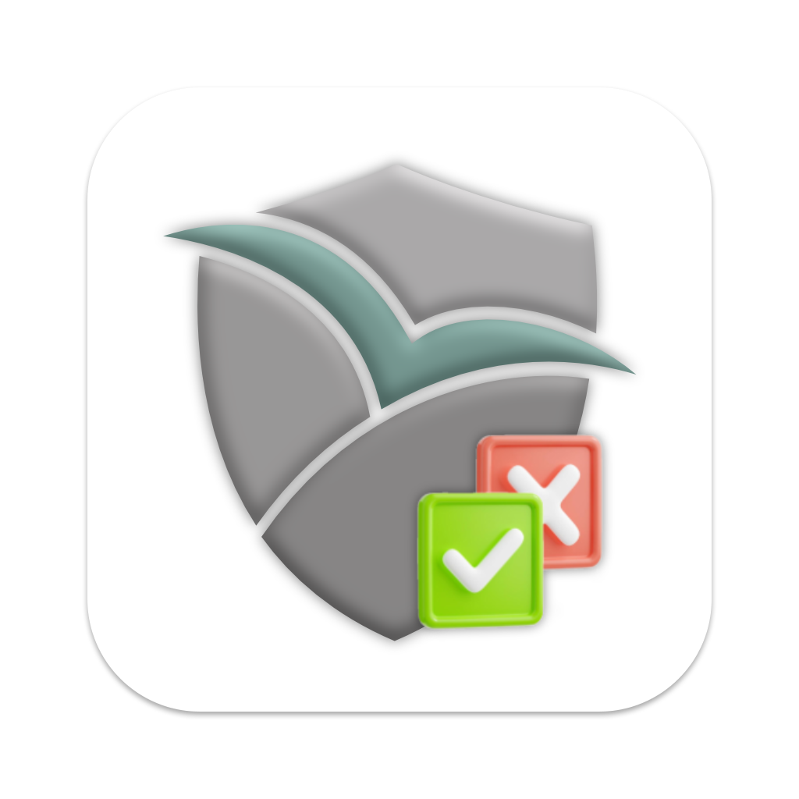

# NetFree Detector

This is a simple script that checks if NetFree is running.

## Installation

Follow these steps to install the NetFree Detector:

1. Clone the repository
2. Navigate to the project directory: `cd NetFree`
3. Install the dependencies: `npm install`
4. Build the project: `npm run package` the output will be in the `out` directory

## Usage

To use the NetFree Detector, run the app:
